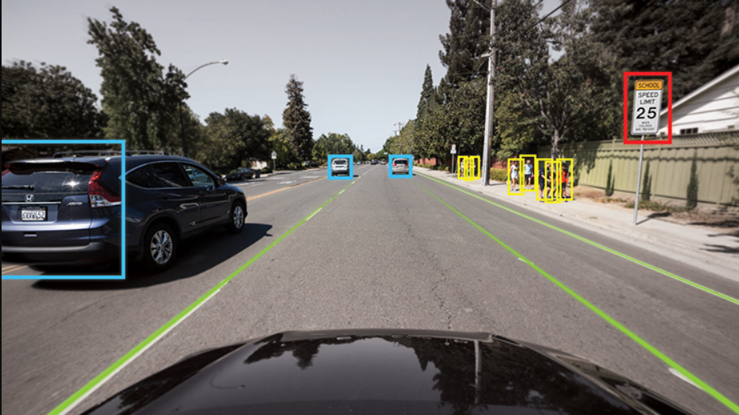
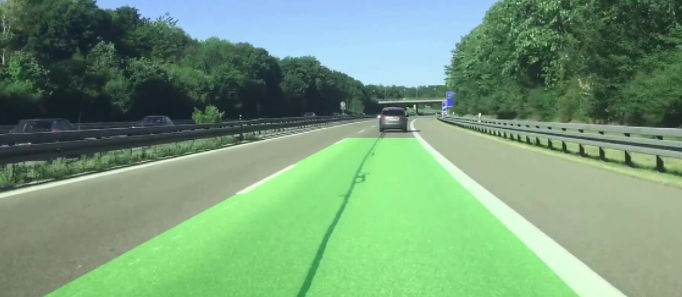
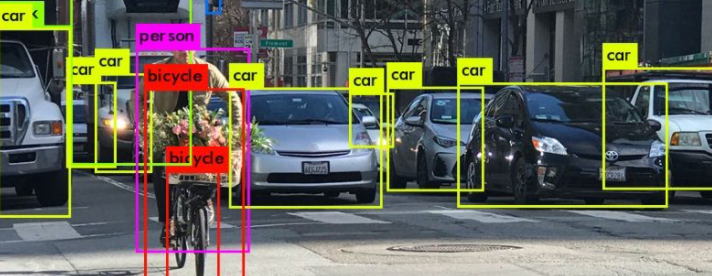
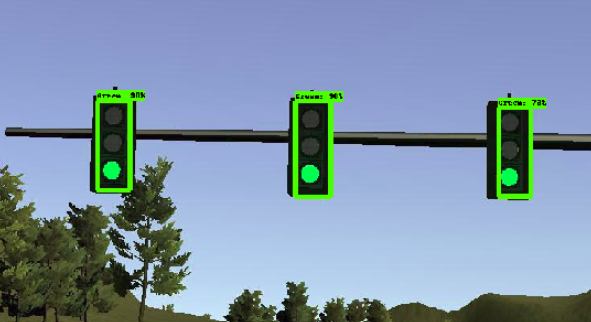
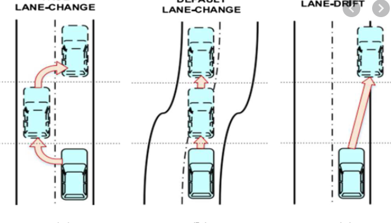

# Autonomous Vehicle

---

  

## `Table of Contents`

- [Description](#)
- [Hardware used](#)
- [Language and Library used](#)
- [Licenses](#licenses)

## `Description`

The hype around driverless cars has grown rapidly over the past several years, with many big technology companies getting behind the concept. The aim of this project is to build a prototype of autonomous vehicle . 

## `Overview of the Project`
<table style="width:100%">
  <tr>
    <th>
      

           
            Basic Lane Detection
            <a href="https://github.com/BK3820/Autonomous_car/tree/main/laneDetection">(code)</a>
      

    </th>
        <th>

           
            Object Detection
            <a href="https://github.com/BK3820/Autonomous_car/tree/main/object_detection">(code)</a>
        

    </th>
       <th>

           
            Traffic light & sign  Detection 
            <a href="https://github.com/BK3820/Autonomous_car/tree/main/Trafficlight">(code)</a>
        

    </th>
        <th>

           
            Lane Changing Behaviour
            <a href="https://github.com/BK3820/Autonomous_car/tree/main/Lane_chng_beh">(code)</a>
        

    </th>
  </tr>
  
</table>

## `Hardware used`

- Rasberry Pi 3 B+
- Arduino UNO
- Pi Camera module
- 10000mAh Power Bank
- L298 H Bridge
- Robo Car Chasis

## `Language and Library used`

- Machine learning(Neural Networks)
- C
- Open cv

